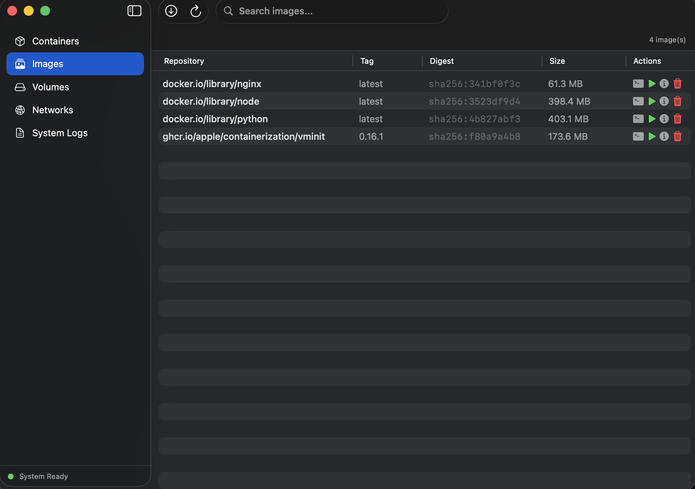

# Images

The Images view lets you browse, pull, run, and manage your local container images.

<!-- screenshot: images-list — the images list view showing several pulled images -->

## Browsing Images

The image list shows each image's repository, tag, digest, and size. Use the search bar to filter by name, tag, or digest.

## Toolbar Controls

| Control | Description |
|---------|-------------|
| **Pull Image** | Opens a dialog to pull a new image from a registry by reference (e.g. `alpine:latest`). |
| **Refresh** | Manually reload the image list. |

## Image Actions

Each image row has action buttons in the Actions column.

<!-- screenshot: image-actions — close-up of the action buttons on an image row -->

| Button | Description |
|--------|-------------|
| 💻 **Configure & Copy Run Command** | Opens the [Run Configuration](run-configuration.md) sheet to set up mounts, environment variables, and copy a ready-to-paste CLI command. |
| ▶️ **Run** | Quickly run a container from this image with an optional name. |
| ℹ️ **Inspect** | Opens a sheet with the full JSON output of `container image inspect`. |
| 🗑 **Remove** | Permanently deletes the image. Asks for confirmation. |

## Pulling Images

Click the **Pull Image** toolbar button and enter an image reference:

<!-- screenshot: pull-dialog — the pull image dialog -->

Examples:
- `alpine:latest`
- `docker.io/library/node:22`
- `ghcr.io/some-org/some-image:v1.0`

A progress indicator appears in the toolbar while the pull is in progress.
