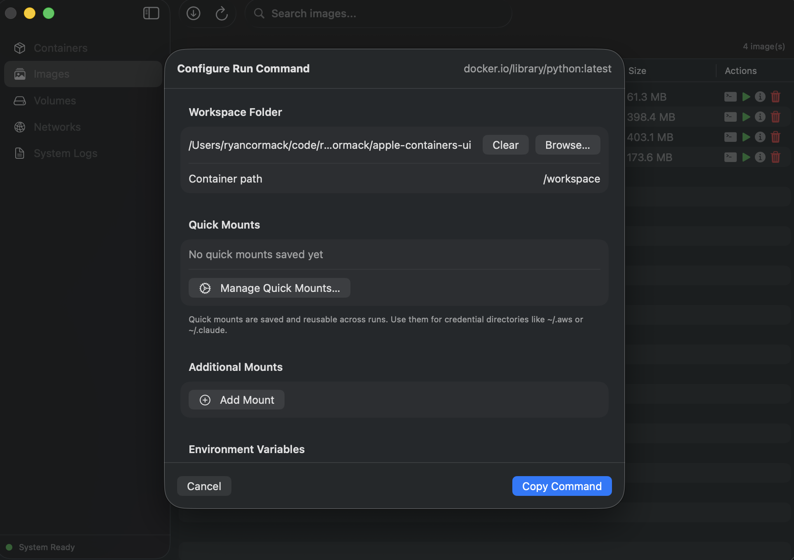
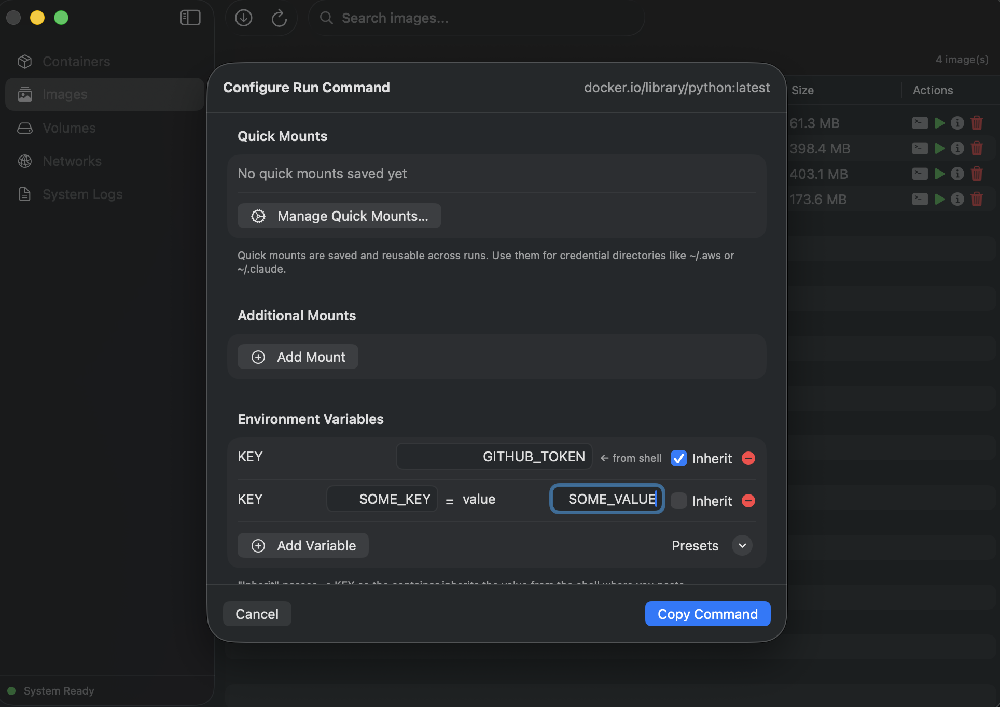

# Run Configuration

When you click the terminal button (💻) on an image, a configuration sheet opens that lets you customise the `container run` command before copying it to your clipboard. This is designed for launching interactive containers — especially useful for running AI coding agents like Kiro CLI or Claude Code inside a container with access to your project files and credentials.

<!-- screenshot: run-config-sheet — the full run configuration sheet -->


## Workspace Folder

Mount a folder from your Mac into the container. This is typically your project directory.

- Click **Browse…** to select a folder
- The default container path is `/workspace` — change it if your tooling expects a different path
- If no folder is selected, no workspace mount is added to the command

## Quick Mounts

Quick mounts are saved volume mounts that you can enable with a single click. They persist across runs and are ideal for credential directories that you mount frequently.

<!-- screenshot: quick-mounts-toggles — the quick mounts section with some toggled on -->

Toggle any saved quick mount to include it in the generated command. For example, enabling "AWS Credentials" adds `-v ~/.aws:/root/.aws` to the command.

### Managing Quick Mounts

Click **Manage Quick Mounts…** to open the manager.

<!-- screenshot: quick-mounts-manager — the quick mounts manager view -->

From here you can:

- **Create custom quick mounts** — give it a name, host path, and container path
- **Add from suggestions** — one-click add for common mounts:
  | Suggestion | Host Path | Container Path |
  |-----------|-----------|----------------|
  | AWS Credentials | `~/.aws` | `/root/.aws` |
  | Claude Code | `~/.claude` | `/root/.claude` |
  | SSH Keys | `~/.ssh` | `/root/.ssh` |
  | Git Config | `~/.gitconfig` | `/root/.gitconfig` |
- **Delete** quick mounts you no longer need

### Example: Running Claude Code with AWS Access

1. Open Quick Mounts manager and add "AWS Credentials" and "Claude Code" from suggestions
2. Back in the config sheet, toggle both on
3. Browse to your project folder
4. Click **Copy Command**
5. Paste into your terminal (where you're logged into AWS SSO)

The generated command will look like:
```bash
/usr/local/bin/container run -it \
  -v ~/my-project:/workspace \
  -v ~/.aws:/root/.aws \
  -v ~/.claude:/root/.claude \
  node:latest /bin/sh
```

## Additional Mounts

For one-off mounts that you don't want to save, use the Additional Mounts section. Enter a host path and container path for each.

## Environment Variables

Add environment variables to pass into the container.

<!-- screenshot: env-vars-section — the environment variables section with some vars added -->


Each variable has an **Inherit** checkbox:

| Mode | Flag Generated | Use Case |
|------|---------------|----------|
| Inherit checked | `-e AWS_PROFILE` | Variable is read from the shell where you paste the command. Use for credentials managed by your shell session. |
| Inherit unchecked | `-e MY_VAR=some-value` | Variable is set to a specific value. Use for configuration that doesn't change. |

### Presets

The **Presets** menu provides one-click addition of common variable sets:

| Preset | Variables |
|--------|-----------|
| AWS Credentials | `AWS_ACCESS_KEY_ID`, `AWS_SECRET_ACCESS_KEY`, `AWS_SESSION_TOKEN`, `AWS_REGION`, `AWS_DEFAULT_REGION`, `AWS_PROFILE` |
| SSH Agent | `SSH_AUTH_SOCK` |

All preset variables default to **Inherit** mode.

## How Credential Forwarding Works

The copied command is designed to be pasted into your terminal. This matters because:

1. **Volume mounts** (`-v ~/.aws:/root/.aws`) make your credential files available inside the container
2. **Inherited env vars** (`-e AWS_PROFILE`) read values from the shell session where you run the command
3. Together, this means if you're logged into AWS SSO in your terminal, the container gets your active session

This approach works because the `container` CLI runs in your shell context — it has access to your home directory and environment variables at the time you execute the command.
